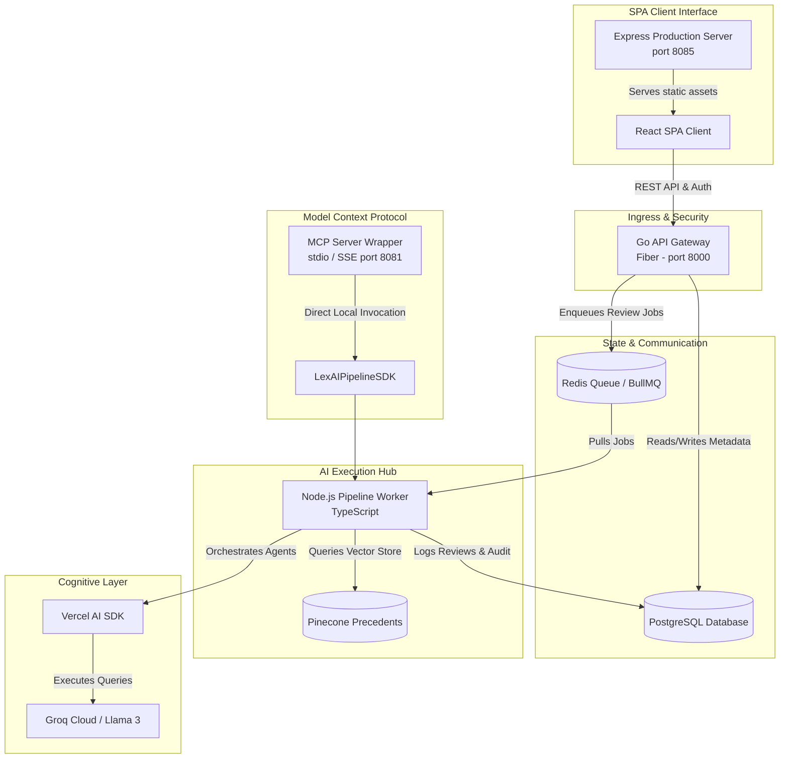

# ⚖️ LexAI SaaS: Contract Analysis & Orchestration Pipeline

🚀 **Enterprise-Grade Polyglot Microservices Platform powered by Go (Fiber), Node.js (TypeScript), Vercel AI SDK, Redis (BullMQ), and React.**

---

<p align="center">
  
  
  
  
</p>
<p align="center">
  
  
  
</p>

---

## 💡 Modernization & Microservice Architecture

LexAI has transitioned from a monolithic Python stack to a **high-performance polyglot microservice architecture**. This ensures optimal resource allocation, type safety, low latency, and modular scalability.



### Why This Modernized Architecture is Better

> [!NOTE]
> **Performance**: By splitting concerns, the Go (Fiber) Gateway handles user sessions, JWT verification, and PostgreSQL transactions with near-zero latency. 
> 
> **AI Orchestration**: Node.js/TypeScript is the premier ecosystem for LLM agent integration. Replacing Python Celery with **BullMQ & Redis** yields lighter memory overhead and simpler serialization.
> 
> **Vercel AI SDK Integration**: Exclusively manages LLM execution, standardizing prompt caching, retry loops, and schema validations.
> 
> **Typesafe State Machine**: Every agent operates on strict, typed TypeScript interfaces (`ContractReviewState`), preventing runtime data drift.

---

## 🏆 What Makes This System Unique & Better

* **Vercel AI SDK Prompt Caching**: Employs SHA-256 prompt hashing and localized JSON response caching (`evals/.llm_cache_node.json`) to skip duplicate LLM queries during local dev or regression testing.
* **Calibrated Risk Scoring**: Scores clauses for risk severity (0-100) and applies strict regulatory filters (e.g. CCPA/GDPR/HIPAA). Applies automatic weighted severity floor calibration for critical terms.
* **Agentic Tracked-Change Redlining**: Rather than just explaining risk, the Redliner generates full tracked-change revisions side-by-side with original text, providing attorneys with an instant draft.
* **Unified Developer SDK**: Includes `LexAIPipelineSDK`, enabling developers to run the multi-agent legal review pipeline programmatically outside the Redis worker process.
* **Dual-Transport MCP Server**: The worker includes an integrated Model Context Protocol (MCP) server supporting **stdio** mode (for IDE extensions like Cursor) and **SSE HTTP** mode (for public endpoints).

---

## 🛠️ Tech Stack & Microservices

| Component | Technology | Description |
| :--- | :--- | :--- |
| **API Gateway** | Go, Fiber, pgx, JWT | Ingress controller, security boundary, user auth, metadata storage |
| **Pipeline Worker** | Node.js, TypeScript, BullMQ | Background async consumer for contract processing |
| **Orchestrator** | Vercel AI SDK, Groq, Pinecone | Multi-agent state machine (Extractor, Scorer, Compliance, Redliner) |
| **Frontend** | React SPA, Vite, Express | Beautiful dark-themed dashboard; served via node Express |
| **Databases** | PostgreSQL, Redis | User data, audit ledger, and worker message queue |
| **Integrations** | Model Context Protocol (MCP) | Exposes legal analysis tools to Cursor, Claude, and local scripts |

---

## 🚀 Getting Started

### 1. Environment Configuration
Create a `.env` file at the root:
```bash
cp .env.example .env
```
Fill in the credentials:
* `GROQ_API_KEY`: API Key for Llama-3 model generation.
* `POSTGRES_DB_URL`: Connection string for PostgreSQL database.
* `REDIS_URL`: Redis server URL for queue caching.
* `PINECONE_API_KEY`: Pinecone API credentials.

---

### 2. Running the Microservices Locally

Start PostgreSQL and Redis in Docker:
```bash
docker run -d -p 5432:5432 -e POSTGRES_USER=legal -e POSTGRES_PASSWORD=legal -e POSTGRES_DB=legaldb postgres:16-alpine
docker run -d -p 6379:6379 redis:7-alpine
```

#### A. Go API Gateway
```bash
cd backend-go
go run main.go
```
*Port: `http://localhost:8000`*

#### B. Pipeline Worker
Build and start the worker queue consumer:
```bash
cd pipeline-worker
npm install
npm run build
npm start
```

#### C. React & Express Frontend
```bash
cd frontend
npm install
npm run build
PORT=8085 npm start
```
*Port: `http://localhost:8085`*

---

## 🔌 Model Context Protocol (MCP) Configuration

LexAI provides an out-of-the-box MCP server to connect the contract review pipeline with AI assistants like **Cursor** or **Claude Desktop**.

### Running the Server

* **Stdio Mode** (Standard for local client plugins):
  ```bash
  cd pipeline-worker
  npm run mcp
  ```
* **SSE (HTTP) Server Mode** (Exposes public port `8081` for remote testing):
  ```bash
  cd pipeline-worker
  MCP_TRANSPORT=sse npm run mcp
  ```

### Adding to Clients

#### Claude Desktop
Add this to your `claude_desktop_config.json`:
```json
{
  "mcpServers": {
    "lexai-pipeline": {
      "command": "node",
      "args": ["/home/dell/legal-contract-pipeline/pipeline-worker/dist/mcp-server.js"],
      "env": {
        "GROQ_API_KEY": "your-api-key"
      }
    }
  }
}
```

#### Cursor Editor
1. Go to **Settings -> Beta -> Features -> MCP**.
2. Add a new server:
   * **Name**: `LexAI`
   * **Type**: `stdio`
   * **Command**: `node /home/dell/legal-contract-pipeline/pipeline-worker/dist/mcp-server.js`

---

## 🛡️ Directory Structure

```
legal-contract-pipeline/
├── backend-go/         # Go API Gateway (Fiber, DB pools, Middleware)
├── pipeline-worker/    # TypeScript Worker (BaseAgent, BullMQ, MCP Server)
│   ├── src/
│   │   ├── agents/     # Vercel AI SDK specialized agent nodes
│   │   ├── pipeline/   # Stateful multi-agent orchestrator logic
│   │   ├── services/   # DOCX parser, PDF exporters, and Pinecone vector store
│   │   ├── sdk.ts      # Standalone LexAIPipelineSDK
│   │   └── mcp-server.ts # MCP Server (stdio & SSE)
├── frontend/           # React SPA Client & Express wrapper
├── infra/              # Local Nginx proxy configurations
├── k8s/                # Kubernetes overlays & resource declarations
└── evals/              # Local evaluation datasets & LLM caching records
```
