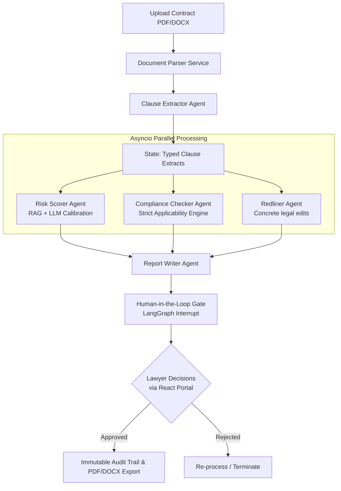

# ⚖️ Legal Contract Pipeline

🚀 **Enterprise-Grade Multi-Agent Legal Analysis and Compliance Pipeline powered by LangGraph, Celery, and React.**

---

<p align="center">
  
  
  
  
</p>
<p align="center">
  
  
  
  
</p>

---

## 💡 Motivation: Why We Built This

Modern legal operations suffer from a massive bottleneck: **manual contract review**. Corporate counsel and contract managers spend hours reading boilerplate clauses, cross-checking compliance rules, drafting standard redlines, and scoring risks. 

Traditional legal-tech solutions fall into two categories:
1. **Dumb regex/rigid keyword search tools** that fail to understand semantic context.
2. **Naive "single-prompt" LLM wrappers** that hallucinate regulations, provide vague suggestions, and fail to guarantee compliance or data residency rules.

**Legal Contract Pipeline** was built to solve this. It provides a robust, state-of-the-art multi-agent framework designed to act as an automated, highly-calibrated first-pass reviewer. It ensures high precision by combining deterministic checks, vector database search (RAG) of historical company precedents, and domain-specific LLM reasoning—always keeping a human lawyer in the loop before final approval.

---

## 🏆 What Makes This System Unique & Better

Unlike generic LLM wrappers, this system is architected for **accuracy, transparency, and safety**:

*   **State-of-the-art LangGraph Orchestration:** Replaces rigid sequential chains with a stateful multi-agent system. Each specialist agent (Extractor, Scorer, Compliance Checker, Redliner, Writer) works on a typed, structured state (`ContractReviewState`).
*   **Calibrated RAG-First Scoring:** The Risk Scorer doesn't guess. It queries **Pinecone** for the top 3 most similar historical clauses to see how human attorneys rated them before calling the LLM.
*   **Strict Regulatory Applicability:** No false positives. Prompts enforce strict applicability rules:
    *   *HIPAA* is only checked if Protected Health Information (PHI) is processed.
    *   *SOX (Sarbanes-Oxley)* only applies to financial reporting and internal corporate controls (never SLAs).
*   **Systemic Violation Grouping:** Rather than listing 10 identical data protection gaps as independent issues, the Report Writer groups repeated violations into unified, actionable "systemic gaps."
*   **Concrete & Actionable Redlines:** Instead of vague advice like "specify a cure period," the Redliner proposes exact legal phrasing and standard fallback terms (e.g., "Add a standard 30-day cure period for material breach...").
*   **Immutable Database Ledger:** The Postgres database revokes `UPDATE` and `DELETE` privileges for the `audit_logs` table at the SQL level, ensuring a tamper-proof audit trail of all agent decisions and human overrides.
*   **Automated Evaluation Harness:** Integrated directly into Jenkins and MLflow. Commits are evaluated against a golden dataset and rejected if accuracy drops below the 60%+ calibration target.

---

## 🌀 Pipeline Architecture



---

## 🛠️ Tech Stack

| Component | Technology | Role |
| :--- | :--- | :--- |
| **Agent Core** | Python, LangGraph, Pydantic v2 | Stateful multi-agent orchestration |
| **RAG Service** | Pinecone, Sentence-Transformers | Precedent search & calibration |
| **Backend API** | FastAPI, SQLAlchemy | High-performance endpoints |
| **Async Worker** | Celery + Redis | Long-running agent execution |
| **Database** | PostgreSQL + Alembic | Transactional storage & audit logs |
| **Frontend** | React, TypeScript, Vite, Zustand | Obsidian-themed interactive dashboard |
| **CI/CD / Evals** | Jenkins, MLflow | Continuous integration, unit testing, model evaluation |
| **Deployment** | Kubernetes, Kustomize, Docker | Orchestrated container hosting |

---

## 🚀 Quickstart

### Environment Setup
Create a `.env` file at the root:
```bash
cp .env.example .env
```
Fill in the following variables:
*   `GROQ_API_KEY` (or LLM credentials)
*   `PINECONE_API_KEY` and `PINECONE_ENVIRONMENT`
*   `DATABASE_URL` and `REDIS_URL`

---

### Option A: Local Run (No Kubernetes)
Best for fast development and iteration on agent logic.

1.  **Configure Databases & Services:**
    Run PostgreSQL and Redis locally, or spin them up quickly in Docker:
    ```bash
    docker run -d -p 5432:5432 -e POSTGRES_USER=legal -e POSTGRES_PASSWORD=legal -e POSTGRES_DB=legaldb postgres:16-alpine
    docker run -d -p 6379:6379 redis:7-alpine
    ```

2.  **Initialize Virtual Environment & Run Migrations:**
    ```bash
    make venv
    make migrate
    ```

3.  **Run Dev Services (Launch in separate terminals or processes):**
    ```bash
    make dev-backend    # Starts FastAPI on http://localhost:8000
    make dev-worker     # Starts Celery Pipeline Worker
    make dev-frontend   # Starts React Client on http://localhost:5173
    ```

---

### Option B: Local Kubernetes Run
Deploys the entire ecosystem locally on a lightweight Kubernetes cluster.

1.  **Build and Load Docker Images:**
    ```bash
    make build
    kind create cluster --name legal-pipeline
    kind load docker-image legal-backend:latest --name legal-pipeline
    kind load docker-image legal-frontend:latest --name legal-pipeline
    ```

2.  **Deploy to Kubernetes:**
    ```bash
    make k8s-local
    ```
    *   **Frontend Access:** `http://localhost:30080`
    *   **API Documentation:** `http://localhost:30800/docs`

---

## 📊 Model Evaluation and Tracking

We maintain a regression-testing eval framework using **MLflow** to track how model updates or prompt edits impact our calibration accuracy.

To run evals locally:
1.  Spin up the local MLflow tracking server:
    ```bash
    make mlflow-up
    ```
2.  Run the evaluation harness:
    ```bash
    make evals
    ```
3.  Access the UI at `http://localhost:5000` to review risk score deviation and precision metrics.

---

## 🛡️ Directory Structure

```
legal-contract-pipeline/
├── backend/            # FastAPI, LangGraph agents, Celery tasks, and migrations
│   ├── app/
│   │   ├── agents/     # Specialist agents (risk, compliance, redline, writer)
│   │   ├── api/        # REST endpoints and services
│   │   └── graph/      # LangGraph state definition and workflow wiring
│   └── tests/          # Python test suite
├── frontend/           # React + TypeScript single-page application
├── infra/              # Nginx proxy and support configurations
├── k8s/                # Kubernetes manifests with environment overlays
├── evals/              # Evaluated datasets and MLflow tracking script
├── Jenkinsfile         # CI/CD multibranch pipeline definition
└── Makefile            # Master service helper commands
```
